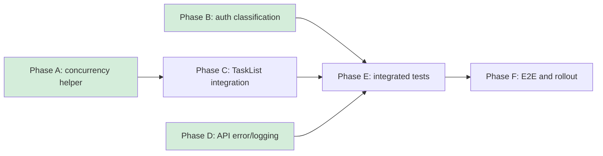

# fix: prevent batch task archive/delete timeouts and false logout

## Executive Summary

Archiving 70+ tasks currently launches every single-task archive request at once.
The resulting Prisma transaction contention produces `P2028` failures and causes
most requests to exceed the shared 15-second client timeout. Authentication
initialization then treats any transient API failure as an invalid credential and
clears the user's session.

Batch deletion uses the same unbounded frontend fan-out (`Promise.all`) and can
create the same transaction storm. It must share the concurrency control and
large-batch regression coverage even though the confirmed production incident
was triggered by archive.

Deliver the fix in three independently testable parts:

1. Bound archive and delete concurrency without changing the existing single-task
   endpoints.
2. Report per-task progress and partial failures for both operations.
3. Clear authentication state only for explicit authentication failures; retain
   the session for timeouts and server failures.

A server-side asynchronous batch API is a later scalability option, not required
for the immediate fix.

## Confirmed Production Evidence

- One operation issued 79 `POST /api/tasks/:taskId/achieve` requests.
- Results were 1 HTTP 200, 5 HTTP 500, and 73 Nginx 499 responses.
- The application log recorded repeated Prisma `P2028` errors:
  `Unable to start a transaction in the given time`.
- Some transactions exceeded the 5-second interactive transaction timeout by
  12–25 seconds.
- The API client aborts every request after 15 seconds.
- `/api/auth/me` subsequently returned HTTP 200, confirming that the JWT had not
  expired or been revoked.
- The web process did not restart and the kernel recorded no OOM event.

## Scope

### In scope

- Limit concurrent task archive and delete requests.
- Preserve successful results and keep only failed tasks selected.
- Show archive/delete batch progress and a final success/partial-failure result.
- Distinguish invalid credentials from transient authentication request failures.
- Add API route and widget/store tests for the complete path.
- Add observability for archive duration and Prisma transaction failures.
- Write the required user-facing bug lesson under `claw/lessons/` before commit.

### Out of scope

- Changing archive semantics, transcript retention, or daemon cleanup behavior.
- Increasing Prisma transaction timeout as the primary remedy.
- Database schema changes.
- Retrying non-idempotent endpoints globally.
- Building a persistent background-job system in the first release.

## Target Flow

```mermaid
sequenceDiagram
    participant User
    participant TaskList
    participant Queue as Mutation queue (max 3)
    participant API as Single-task archive/delete API
    participant DB as Prisma/Database

    User->>TaskList: Archive 79 selected tasks
    TaskList->>Queue: Enqueue task IDs
    loop At most 3 active requests
        Queue->>API: POST /tasks/:id/achieve
        API->>DB: Teardown transaction
        DB-->>API: Archived or typed error
        API-->>Queue: Result
        Queue-->>TaskList: Update progress
    end
    TaskList-->>User: 76 archived, 3 failed; retry failed
```

Deletion follows the same bounded queue, substituting
`DELETE /tasks/:id`. It reports deleted and failed IDs separately and never
automatically retries an ambiguous timeout.

## Design

### 1. Add a bounded-concurrency helper

Create a small reusable helper, for example:

- `web/src/shared/async/map-concurrent.ts`
- Input: items, concurrency, async worker.
- Output: an ordered `PromiseSettledResult[]`, matching the current
  `Promise.allSettled` result shape.
- Default task-mutation concurrency: `3`, shared by archive and delete.

The helper must:

- Never launch more than the configured number of workers.
- Preserve input/result ordering.
- Continue processing after individual failures.
- Avoid automatic retries in the helper.

Start with concurrency 3. Each archive may wait up to 2.5 seconds for a daemon
stop acknowledgement and then performs transactional cleanup; three concurrent
operations provide useful throughput without recreating the 79-transaction burst.
Deletion also performs runtime/worktree teardown and database writes, so it uses
the same conservative limit.

### 2. Update the batch archive UI

Modify `web/src/features/tasks/components/TaskList.tsx`:

- Replace the unbounded `Promise.allSettled(taskIds.map(...))` call with the
  bounded helper.
- Keep the existing successful-task removal and failed-task selection behavior.
- Display progress while running, such as `Archiving 12 of 79`.
- Disable selection mutation and repeated archive submission during the batch.
- On completion:
  - all success: show the existing success toast;
  - partial failure: show counts and retain only failed IDs;
  - all failure: keep all IDs selected and show the first actionable error.
- If a request times out, do not immediately retry it: the archive endpoint is
  idempotent, but the server may complete after the client aborts. A user retry
  safely rechecks `achievedAt`.

Do not increase the global 15-second API timeout. Bounded concurrency removes the
queueing pressure; changing the global timeout would hide unrelated slow APIs.
Use a task archive/delete-specific 60-second timeout so an aborted browser
request does not immediately free a queue slot while its server-side teardown
may still be running.

### 3. Update the batch delete UI

Modify `web/src/features/tasks/components/TaskList.tsx`:

- Replace `Promise.all([...selectedTaskIdSet].map(deleteTask))` with the same
  bounded helper used by archive.
- Use settled per-task results instead of failing the entire aggregation on the
  first rejection.
- Display progress such as `Deleting 12 of 79`.
- Remove successfully deleted task IDs from selection and retain only failed
  task IDs for deliberate user review/retry.
- Report `N deleted, M failed` rather than a generic whole-batch failure.
- Prevent double submission and archive/delete overlap while either mutation
  queue is active.
- Never automatically retry deletion. A timeout is ambiguous because the server
  may have completed the irreversible delete after the client aborted. A manual
  retry should treat a resulting 404 as “already deleted” only after that
  behavior is explicitly defined and tested.

### 4. Correct authentication failure classification

Modify `web/src/features/auth/store.ts` to use an explicit predicate such as
`isAuthenticationFailure(error)`:

- Logout on `ApiRequestError` status 401.
- Treat 403 as logout only where the endpoint contract means the credential is
  no longer authorized; subscription/permission 403 responses must not erase
  credentials.
- Preserve the existing session for:
  - request timeout;
  - network failure;
  - HTTP 429;
  - HTTP 5xx;
  - malformed/transient response.
- Set a recoverable error state and allow retry for transient failures.

Apply this behavior to both `initFromStorage` and `fetchUser`. During
`initFromStorage`, a stored JWT plus a transient failure should leave the
persisted session intact and render a retry/error state, not route to login.

Avoid putting automatic logout into the generic API client. Authentication
policy belongs in the auth store because not every 401-like upstream response
means the Conductor web session is invalid.

### 5. Harden and instrument the archive route

Keep `POST /api/tasks/:taskId/achieve` idempotent. Add structured logging around:

- task ID and project ID;
- total route duration;
- daemon acknowledgement wait duration;
- transaction start/duration;
- Prisma error code;
- final result status.

Catch known Prisma `P2028` errors at the route boundary and return a typed,
retryable response, preferably HTTP 503:

```json
{
  "error": "Archive is temporarily busy; retry this task.",
  "code": "archive_busy",
  "retryable": true
}
```

This does not replace concurrency control, but prevents an empty generic 500 and
lets the UI present an actionable message.

Do not add blind transaction retries inside `teardownTaskRuntime`: it includes
daemon commands and worktree cleanup decisions. Any retry must be restricted to
the database transaction boundary and added only after proving it is safe.

## Testing Strategy

### Unit tests

- `web/src/shared/async/map-concurrent.test.ts`
  - Never exceeds concurrency 3.
  - Preserves result ordering.
  - Continues after rejection.
  - Handles empty and smaller-than-limit inputs.

- `web/src/features/auth/store.test.ts`
  - 401 clears session and stored credentials.
  - 500, timeout, network failure, and 429 preserve session.
  - Transient `initFromStorage` failure does not redirect the user to login.
  - A later successful retry refreshes the user.

### Widget tests

- Extend `web/src/features/tasks/components/TaskList.test.tsx`:
  - Select at least 70 tasks and assert no more than 3 archive calls are active.
  - Assert progress advances.
  - Assert partial failures remain selected.
  - Assert a timeout does not clear authentication state.
  - Assert double submission is prevented.
  - Select at least 70 tasks for deletion and assert no more than 3 delete calls
    are active.
  - Assert the delete queue continues after an individual failure.
  - Assert delete progress advances and only failed delete IDs remain selected.
  - Assert archive and delete cannot run concurrently from the selection toolbar.
  - Assert an ambiguous delete timeout is not automatically retried.

### API route tests

- Extend `web/src/app/api/tasks/[taskId]/achieve/route.test.ts`:
  - Existing idempotency remains intact.
  - `P2028` maps to the typed retryable response.
  - Authentication failures remain 401.
  - Successful archive still broadcasts `task_achieved`.

### Local E2E

Seed a project with at least 80 archivable AI tasks, then:

1. Sign in and select all project tasks.
2. Archive the selection.
3. Verify active archive requests never exceed 3.
4. Verify all tasks eventually disappear from the active list.
5. Verify transcripts appear under Achieved Tasks.
6. Verify the user remains signed in throughout.
7. Inject one retryable archive failure and verify only that task remains
   selected.
8. Seed a second set of at least 80 disposable tasks and batch-delete them.
9. Verify active delete requests never exceed 3, successful tasks disappear,
   and the user remains signed in.
10. Inject one delete failure and verify the queue finishes all other tasks,
    reports exact success/failure counts, keeps only the failed task selected,
    and performs no automatic retry.

Run:

- `cd web && pnpm test`
- The repository's local E2E flow from `AGENTS.md`.

## Rollout and Monitoring

1. Release auth classification and bounded archive/delete concurrency together.
2. Before commit, add
   `claw/lessons/stable_batch_archive_transaction_storm_false_logout_20260728.md`
   covering symptom, root cause, fix, and prevention.
3. Deploy normally; no migration or dependency install should be required.
4. Perform production-like manual archive and delete operations on separate sets
   of 70+ seeded tasks.
5. Monitor for 24 hours:
   - count of `/achieve` 500/503/499 responses;
   - count of batch-triggered `DELETE /api/tasks/:id` 500/503/499 responses;
   - Prisma `P2028` count;
   - p50/p95/p99 archive duration;
   - unexpected logout events following 5xx/timeouts.

Rollback is code-only: revert the frontend queue/auth changes. No persisted data
format changes are introduced.

## Acceptance Criteria

- Archiving 70–100 selected tasks never creates more than 3 concurrent archive
  requests from one browser batch.
- Deleting 70–100 selected tasks never creates more than 3 concurrent delete
  requests from one browser batch.
- The batch completes without Prisma `P2028` under the agreed production-like
  load test.
- A timeout, network error, HTTP 429, or HTTP 5xx never clears a valid session.
- An explicit `/auth/me` HTTP 401 still clears the invalid session.
- Partial archive success is accurately reported and only failed tasks remain
  selected.
- Partial delete success is accurately reported, only failed tasks remain
  selected, and delete timeouts are never automatically retried.
- Re-running archive for a timed-out but already archived task succeeds
  idempotently.
- Existing single-task archive behavior remains unchanged.
- Required API route and widget/store tests pass.

## Execution Strategy



| Phase | Name | Depends On | Can Parallelize With | Effort |
|---|---|---|---|---|
| A | Concurrency helper and unit tests | — | B, D | S |
| B | Authentication error classification and tests | — | A, D | M |
| C | TaskList archive/delete queue and progress integration | A | B, D | M |
| D | Typed archive errors and structured logging | — | A, B, C | S |
| E | Integrated widget/API regression tests | B, C, D | — | M |
| F | E2E, lesson document, rollout verification | E | — | M |

### Phase tasks

- [PARALLEL:foundation] Implement and test the concurrency helper.
- [PARALLEL:foundation] Implement and test auth error classification.
- [PARALLEL:foundation] Add typed `P2028` handling and route instrumentation.
- [SERIAL:after-foundation] Integrate bounded execution and progress into
  `TaskList`.
- [SERIAL:after-foundation] Add separate 70+ task archive and delete regression
  coverage.
- [SERIAL:after-foundation] Run local E2E and write the required lesson.

## Future Option: server-side batch jobs

Introduce `POST /api/tasks/batch-achieve` only if batches regularly exceed a few
hundred tasks, must survive browser closure, or need cross-device progress.
That design would require durable job state, polling or realtime progress,
cancellation semantics, and operational recovery. It is intentionally deferred
because bounded client concurrency fixes the confirmed incident with much less
surface area.
