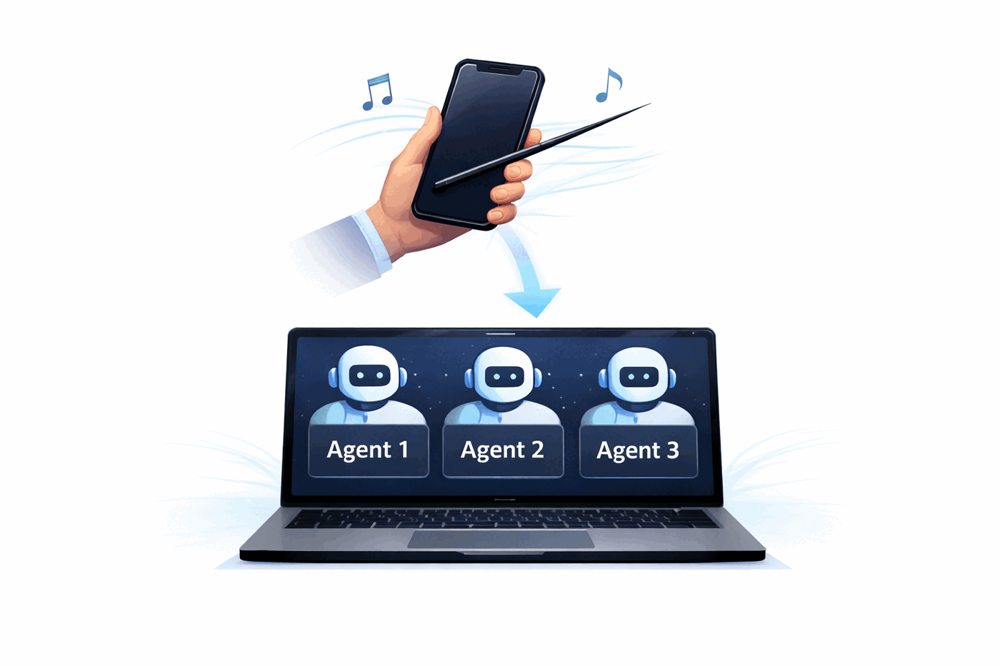

Your AI workforce. Anywhere.

Conductor lets you control AI workers running on your computer from anywhere.

Think of it as TeamViewer for the AI era.

Your agents run on your computer.
Your phone becomes the control panel.

# The problem

You start several coding agents.

They are running experiments, writing code, fixing bugs.

Then it is time to leave work.

The agents are still running.

Do you stay and wait?
Or shut everything down?

# Another situation

You suddenly have an idea.

You want to test it immediately.

You want an agent to implement it.

But you are not in front of your computer.

# The solution

Conductor lets you direct your agents remotely.

From your phone you can:

- start new tasks

- monitor agent progress

- send new instructions

- manage multiple agents

Anywhere. Anytime.

# Why “Conductor”

Your phone becomes the baton.

Your agents become the orchestra.

You conduct them to execute your ideas.

# What you can do

With Conductor you can:

- run coding agents on your computer

- monitor tasks remotely
 
- launch experiments anytime
 
- manage multiple agents at once
 
- keep work running even when you leave

Start conducting your AI workforce.

<DocsIndexCards lang="en" />
